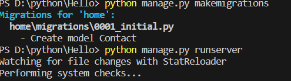
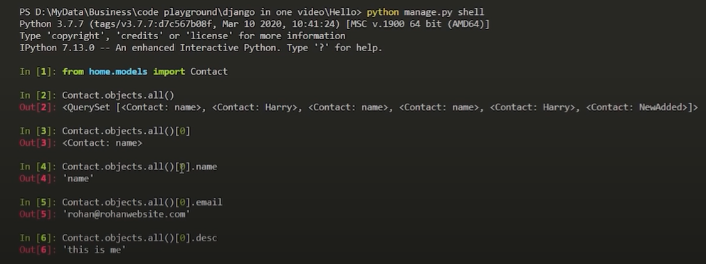

***To create project***

- django-admin startproject (***projectname***)

***To run server***

- python manage.py runserver

**After Poject create we have to create app in project**

- To create app - python manage.py startapp home

***Check changes in file -***

This command creates tables, modifies columns, adds indexes, and performs any other database-related operations needed to reflect the changes you've made.

- Command1
        
        python manage.py makemigrations
- Command 2 

        python manage.py migrate

# File changes

1. After create app we have add ***urls.py*** file in ***App folder***. 

    -   In **urls.py file**

            from django.contrib import admin
            from django.urls import path
            from home import views 
            <!-- (import view file from the project folder into app file) -->

            urlpatterns = [ 
                path("", views.index, name = 'home'),
                path("about/", views.about, name = 'about'),
            ]
    And in this file all urls for website get added. Like **about** when we click on about then url shift to about url

2. Changes in ***setting.py** file of App File

    - To link **static file**
        
            import os

            <!-- added manually -->

            STATICFILES_DIRS = [
                os.path.join(BASE_DIR, "static")
            ]
    - To call **Templates file** - In setting files of project at Template section we have to add ***template base directory in DIRS***

            TEMPLATES = [
                {
                    'BACKEND': 'django.template.backends.django.DjangoTemplates',
                    'DIRS': [os.path.join(BASE_DIR, "templates")],
                    'APP_DIRS': True,
                    'OPTIONS': {
                        'context_processors': [
                            'django.template.context_processors.debug',
                            'django.template.context_processors.request',
                            'django.contrib.auth.context_processors.auth',
                            'django.contrib.messages.context_processors.messages',
                        ],
                    },
                },
            ]

3. When there is a empty url then they call Project urls.py file

    -   Project ***urls.py*** files
            <!-- by defalut admin url is present and if we want to enter any url to work as default urls we have to add here -->

            from django.contrib import admin
            from django.urls import path , include

            urlpatterns = [
                path('',include('home.urls')),
                path('admin/', admin.site.urls),
            ]

# Website urls and File calling

1. To Call static file in website manually

    - We type **url/static/(***file name***)**

2. Now we calling html file from ***view.py*** file which is present in App folder(home)

        from django.shortcuts import render

        # Create your views here.
        def index(request):
            return render(request,'index.html' )
    
    <!-- they return the html file which is present in template file with name of index.html -->

3. Now we have to create a html file in template folder with **index.html**

4. When ever we click on any link. We want that Header and Footer remain same only content get changed. For that we create a html file
    - eg - **we create a nav.html** in this Header and footer code will saved for every page

5. After create nav html file we want to update content f body not all webpage.
    - So we Add in nav html file after **Navbar** and before **Footer**
        
            

6. To use Navbar and footer in every webpage 
    - We use ***Extend*** function in html file where we want that navbar and footer
    
            

            
            This is body
            

# Work in ADMIN

1. To login in admin panel of Django we have to create a **super user** 

    Command -

        python manage.py createsuperuser

2. To change the Django Admin Text
    -   We can make the three changes in urls.py of Project file

            min.site.site_header = "UMSRA Admin"
            admin.site.site_title = "UMSRA Admin Portal"
            admin.site.index_title = "Welcome to UMSRA Researcher Portal"

# CSRF

- It stands for Cross Site Request Forgery
- Command -
  
        
- The transfer request is extended with a third argument: http://www.mybank.com/transfer?to=123456;-amount=10000;token=31415926535897932384626433832795028841971.
- That token is a huge, impossible-to-guess random number that mybank.com will include on their own web page when they serve it to you. It is different each time they serve any page to anybody.
- The attacker is not able to guess the token, is not able to convince your web browser to surrender it (if the browser works correctly...), and so the attacker will not be able to create a valid request, because requests with the wrong token (or no token) will be refused by ***www.mybank.com.***

# How Database is created in Django

## How Model is created 

- Work in ***models.py*** file

- A model is the single, definitive source of information about your data. It contains the essential fields and behaviors of the data you’re storing. Generally, each model maps to a single database table.
  
    Code - 

            from django.db import models

            # Create your models here.
            class Contact(models.Model):
                name = models.CharField(max_length=100)
                email = models.CharField(max_length=100)
                message = models.CharField(max_length=100)
                
                def __str__(self):
                        return self.name 

### After create model in models file, Then we have to **makemigrations**. They show ***no changes detected***
1. To detect changes we have to register model in **admin.py** file in App folder
   
            from django.contrib import admin
            from home.models import Contact

            admin.site.register(Contact)
2. Now go to **app.py** in App folder and copy the class name 
3. Paste it in settings.py in Project folder at ***INSTALLED_APPS***  
    
            ''(App name).apps.(Classnamecome from app.py)
4.  To detect changes in Databae we have to - makemigrations
     
5. After makemigrstions we have apply changes in Database
    - So we migrate the changes by giving command 
  
    Command -

            python manage.py migrate

### After creating model for Form submission 

1. Now we Write logic to Enter data from webpage to Database. For do that we modify **view.py** in App folder
   
   - First we have to **import model** from the model files
  
            from home.models import Contact

   - After import we have to handle Post request

            def contact(request):
                if request.method=="POST":
                    name=request.POST.get('name')
                    email=request.POST.get('email')
                    message=request.POST.get('message')
                    contact = Contact(name = name, email=email, message = message)
                    contact.save()
                return render(request,'contact.html' )

## How we access the database in terminal

<!-- ------------------------------------------------------- -->
what is modules, package, functions