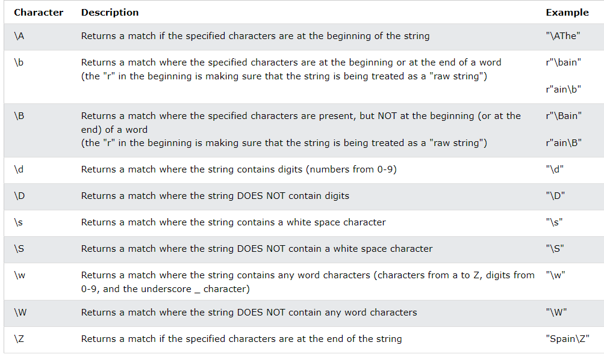
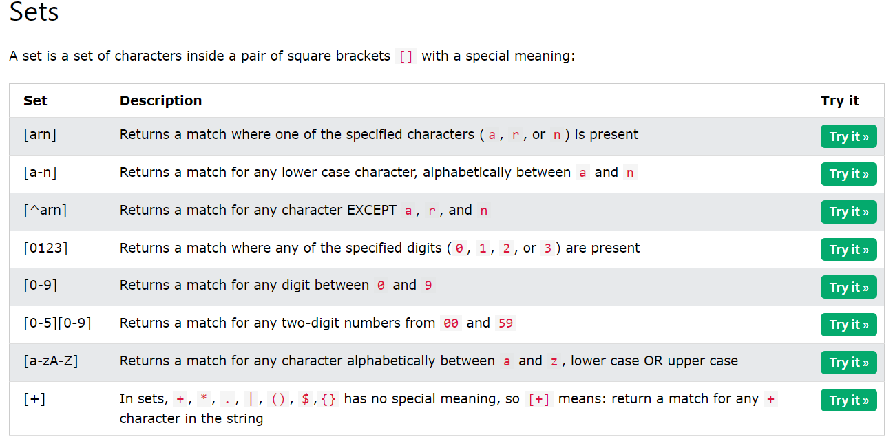

# Regular Expression

 - A Regular expression is a special sequence of character that uses a search pattern to find a strung or set of strings

 - It can detect the presence or absence of a text by matching it with a particular pattern, and also can split a pattern into one or more sub patterns

## Re Module

Python provides a ***re*** module whole primary is to offer a search, where it takes a ***regular expression*** and a ***string***

**import re** is used to import the re module

# RegEx Functions

- ***findall*** - Return a list containing all matches
    
    Code for - .
    
    Search for a sequence that starts with "he", followed by two (any) characters, and an "o"

        txt = "hello planet"
        x = re.findall("he..o", txt)
        print(x)

    
    Code for - |
    
            d = " xyz,yx,xyzz,xyyz,xxzzy"       
            match = re.findall(r"xy|zz",d)
            print(match)
    

- ***search*** - Return a Match object if there is match anywhere in the string
    -   if there is more than one match, only the first occurrence of the match will be returned:
    Code -

            import re

            txt = "The rain in Spain"
            x = re.search("rain", txt)
            print(x)
    
    Code for - \

    _dot is special character to escape this we use special sequence. if we don't _

    - when we try to search in string we always write ***r*** before meta characters

            b = "vivek.Vivek@gmail.com"
            match = re.search(r"\.",b)
            print(match)
    
    Code for - []

            b = "vivek.Vivek@gmail.com"
            match = re.search(r"[@]",b)
            print(match)

    Code for - ^

    _Matches the beginning of letter_

            b = "vivek.Vivek@gmail.com"
            match = re.search(r"^vivek",b)
            print(match)

    Code for - |

            d = " xyz,yx,xyzz,xyyz,xxzzy"       
            match = re.search(r"xy|zz",d)
            print(match)
    
    
    Code for - $
    
    _Matches the end_

            b = "vivek.Vivek@gmail.com"
            match = re.search(r"com$",b)
            print(match)

- ***split*** - Return a list where the string has been split at each match
- ***sub*** - Replaces one or many matches with a string

# Special Sequences in RegEx

- Special sequences do not match for the actual character in the string instead it tells the specific location in the search string where the match must occur.

- it makes it easier to write commonly used patterns

 

# RegEx Sets

- A set is set of characters inside a pair of square brackets [] with a special meaning

